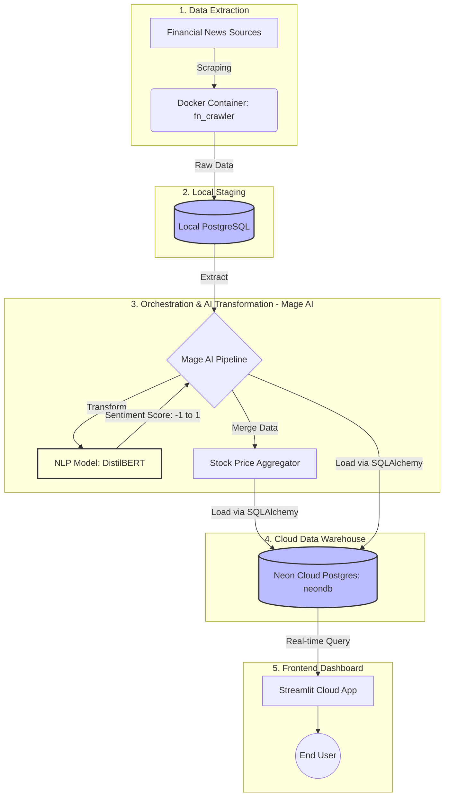

# 📈 FinNexus 2.0: AI Financial Intelligence Platform

🎯 **Live Demo:** [FinNexus AI Intelligence Dashboard](https://finnexus-ai-intelligence.streamlit.app/)

**FinNexus 2.0** is a comprehensive End-to-End Data Engineering platform built upon Clean Architecture principles. The system automates financial news ingestion, leverages AI for Market Sentiment Analysis, and discovers real-time correlations with stock price fluctuations across multiple tickers.

---

## 📑 Table of Contents
- [Project Overview](#-project-overview)
- [System Showcase](#-system-showcase)
- [System Architecture](#-system-architecture)
- [Core Features](#-core-features)
- [Tech Stack](#-tech-stack)
- [Database Schema](#-database-schema)
- [Author](#-author)

---

## 🚀 Project Overview
In today's information-driven era, stock market volatility is heavily impacted by financial news. **FinNexus** was developed to address a critical question: *How can we automatically quantify market sentiment from thousands of daily financial articles and correlate it with stock prices?*

This project seamlessly integrates **Data Extraction** (Docker Crawler), **Data Orchestration & Transformation** (Mage AI + NLP DistilBERT), **Cloud Data Warehousing** (Neon Serverless Postgres), and **Data Visualization** (Streamlit).

---

## 📸 System Showcase

Below are demonstrations of the system's actual workflows, from Backend to Frontend:

**Live Demo Project:** https://finnexus-ai-intelligence.streamlit.app/

### 1. Visual Analytics Interface (Streamlit Dashboard)
*The interactive dashboard provides a comprehensive overview of market sentiment and its correlation with stock prices.*

### 2. Data Orchestration Flow (Mage AI Pipeline)
*The ETL pipeline automates raw data scraping, triggers the AI model for sentiment scoring, and merges the datasets.*

### 3. Cloud Storage (Neon Serverless Postgres)
*Transformed data is automatically loaded into the Cloud Data Warehouse, ready for real-time querying.*

---

## 🗺️ System Architecture

The system is designed following the enterprise-standard **ETL (Extract - Transform - Load)** model, strictly separating Staging (Local) and Production (Cloud) environments to optimize performance and ensure data integrity.

### ⚙️ Detailed Workflow:

1. **Extract**: A background Docker job scrapes the latest news and ingests it into a Local PostgreSQL database (Staging Area).
2. **Transform**: Mage AI is triggered to extract the raw data. Unprocessed articles are passed through an AI model (DistilBERT) for Natural Language Processing, assigning sentiment labels (POSITIVE, NEGATIVE, NEUTRAL) and scores (-1.0 to 1.0).
3. **Merge**: Sentiment data is aggregated and merged with historical stock prices (VN-Index, FPT, HPG, SSI...).
4. **Load**: The finalized dataset is loaded directly into the Cloud Data Warehouse (Neon Serverless Postgres) via SQLAlchemy.
5. **Visualize**: The Streamlit Dashboard dynamically renders charts based on the latest cloud data, featuring a robust, fault-tolerant mechanism.

---

## ✨ Core Features

* **Automated Data Ingestion:** An independent Crawler running within a Docker container, ensuring high scalability and environment isolation.
* **AI-Powered Sentiment Analysis:** Integrates state-of-the-art NLP models to convert unstructured text data into quantifiable metrics.
* **Multi-Ticker Correlation:** Parallel correlation analysis between news sentiment and price fluctuations across multiple stock tickers.
* **Fault-Tolerant Dashboard:** A "bulletproof" frontend equipped with `try-except` wrappers, automated `NaN` cleaning, and smart schema mapping (e.g., `stock_price` -> `Close`).

---

## 🛠️ Tech Stack

| Layer | Technology | Purpose |
| --- | --- | --- |
| **Data Extraction** | Python, Docker | Build and isolate the crawler environment |
| **Orchestration** | Mage AI | Build and manage ETL pipelines (DAGs) |
| **AI / NLP** | HuggingFace, Transformers | Calculate article sentiment scores |
| **Data Storage** | PostgreSQL, Neon Cloud | Staging (Local) and Data Warehousing (Cloud) |
| **Data Processing** | Pandas, SQLAlchemy | Data cleaning, type casting, and structured data manipulation |
| **Frontend / BI** | Streamlit, Altair, Plotly | Build interactive visual dashboards |

---

## 🗄️ Database Schema

The system operates based on 2 main tables on Neon Cloud:

1. **`news_articles`**: `[published_at, title, url, sentiment_label, sentiment_score]` - Stores AI-processed news articles.
2. **`market_correlation`**: `[date, ticker, close, sentiment_score]` - Merged dataset of closing stock prices and average daily sentiment scores.

---

## 👨‍💻 Author

* **Nguyen Nhut Nam**
* *Data Engineer | Python Developer*
