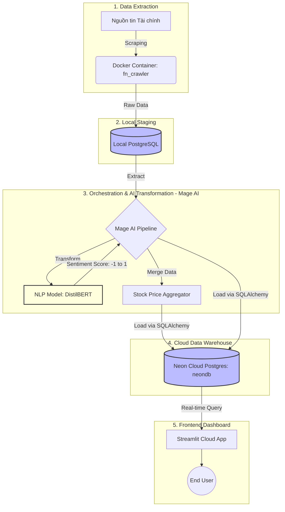

# 📈 FinNexus 2.0: AI Financial Intelligence Platform


**FinNexus 2.0** là một hệ thống Data Engineering toàn diện (End-to-End), được thiết kế với kiến trúc Clean Architecture để tự động hóa việc thu thập tin tức tài chính, phân tích tâm lý thị trường (Sentiment Analysis) bằng AI, và tìm ra mối tương quan với biến động giá cổ phiếu (Multi-Ticker) theo thời gian thực.

---

## 📑 Mục lục
- [Giới thiệu Dự án](#-giới-thiệu-dự-án)
- [Kiến trúc Hệ thống (System Architecture)](#-kiến-trúc-hệ-thống-system-architecture)
- [Các Tính năng Cốt lõi](#-các-tính-năng-cốt-lõi)
- [Công nghệ Sử dụng (Tech Stack)](#-công-nghệ-sử-dụng-tech-stack)
- [Cấu trúc Dữ liệu (Database Schema)](#-cấu-trúc-dữ-liệu-database-schema)
- [Cấu trúc Thư mục (Project Structure)](#-cấu-trúc-thư-mục-project-structure)
- [Tác giả](#-tác-giả)

---

## 🚀 Giới thiệu Dự án
Trong kỷ nguyên thông tin, biến động của thị trường chứng khoán chịu ảnh hưởng mạnh mẽ bởi tin tức. **FinNexus** ra đời nhằm giải quyết bài toán: *Làm thế nào để lượng hóa tâm lý thị trường từ hàng ngàn bài báo tài chính mỗi ngày và đối chiếu nó với giá cổ phiếu?*

Dự án là sự kết hợp hoàn hảo giữa **Data Extraction** (Docker Crawler), **Data Orchestration & Transformation** (Mage AI + NLP DistilBERT), **Cloud Data Warehousing** (Neon Postgres), và **Data Visualization** (Streamlit).

---

## 🗺️ Kiến trúc Hệ thống (System Architecture)

Hệ thống được thiết kế theo mô hình **ETL (Extract - Transform - Load)** chuẩn doanh nghiệp, chia tách rõ ràng môi trường Staging (Local) và Production (Cloud) để tối ưu hóa chi phí và hiệu suất.




### ⚙️ Luồng hoạt động chi tiết:

1. **Extract**: Job Docker chạy ngầm cào tin tức mới nhất và đổ vào CSDL PostgreSQL Local (Đóng vai trò là Staging Area để tránh thất thoát dữ liệu).
2. **Transform**: Mage AI được trigger, kéo dữ liệu thô từ Local lên. Các bài báo chưa phân tích sẽ được đưa qua mô hình AI (DistilBERT) để đọc hiểu tiếng Việt và gán nhãn (POSITIVE, NEGATIVE, NEUTRAL) kèm điểm số (-1.0 đến 1.0).
3. **Merge**: Dữ liệu tâm lý (Sentiment) được gộp (merge) với dữ liệu giá cổ phiếu lịch sử (VN-Index, FPT, HPG, SSI, VCB, VNM...).
4. **Load**: Dữ liệu thành phẩm được "bắn" thẳng lên Data Warehouse (Neon Cloud Serverless Postgres) tại Singapore.
5. **Visualize**: Streamlit Dashboard tự động render các biểu đồ Altair/Plotly dựa trên dữ liệu Cloud mới nhất, loại bỏ hoàn toàn các lỗi sai lệch kiểu dữ liệu (Data Type Casting) hay thiếu hụt Schema.

---

## ✨ Các Tính năng Cốt lõi

* **Automated Data Ingestion:** Hệ thống Crawler chạy độc lập trong Docker Container, đảm bảo khả năng mở rộng và không bị giới hạn môi trường.
* **AI-Powered Sentiment Analysis:** Tích hợp mô hình NLP tiên tiến để xử lý ngôn ngữ tự nhiên, biến dữ liệu văn bản phi cấu trúc thành các chỉ số định lượng.
* **Multi-Ticker Correlation:** Khả năng phân tích tương quan song song giữa điểm tâm lý tin tức và biến động giá của nhiều mã cổ phiếu cùng lúc.
* **Fault-Tolerant Dashboard:** Frontend được thiết kế "chống đạn" (Bulletproof) với cơ chế bọc lỗi `try-except`, tự động làm sạch `NaN` và mapping Schema thông minh (vd: tự động chuyển `stock_price` thành `Close`).
* **Real-time Monitoring:** Giao diện trực quan hóa dòng chảy tin tức theo thời gian thực với cảnh báo màu sắc tương ứng với cảm xúc thị trường.

---

## 🛠️ Công nghệ Sử dụng (Tech Stack)

| Layer | Công nghệ | Mục đích |
| --- | --- | --- |
| **Data Extraction** | Python, Docker | Xây dựng và cô lập môi trường Crawler |
| **Orchestration** | Mage AI | Xây dựng và quản lý luồng ETL Pipeline (DAGs) |
| **AI / NLP** | HuggingFace, Transformers | Chấm điểm cảm xúc bài báo |
| **Data Storage** | PostgreSQL, Neon Cloud | Lưu trữ Staging (Local) và Data Warehouse (Cloud) |
| **Data Processing** | Pandas, SQLAlchemy, Numpy | Làm sạch, ép kiểu và thao tác dữ liệu cấu trúc |
| **Frontend / BI** | Streamlit, Altair, Plotly | Xây dựng Dashboard tương tác trực quan |

---

## 🗄️ Cấu trúc Dữ liệu (Database Schema)

Hệ thống hoạt động dựa trên 2 bảng chính trên Neon Cloud:

1. **`news_articles`**: `[published_at, title, url, sentiment_label, sentiment_score]` - Lưu trữ tin tức đã qua xử lý AI.
2. **`market_correlation`**: `[date, ticker, close, sentiment_score]` - Dữ liệu đã gộp giữa giá cổ phiếu đóng cửa và điểm tâm lý trung bình trong ngày.

---

## 📁 Cấu trúc Thư mục (Project Structure)

Dự án áp dụng nguyên tắc Clean Architecture, tách biệt rõ ràng giữa Backend Service và UI Components:

```text
finnexus/
│
├── services/
│   ├── dashboard/                  # Thư mục gốc của Frontend Streamlit
│   │   ├── app.py                  # File chạy chính của Dashboard
│   │   ├── requirements.txt        # Các thư viện Python cần thiết
│   │   │
│   │   ├── components/             # Các module giao diện (UI)
│   │   │   ├── sidebar.py          # Bộ điều khiển lọc dữ liệu
│   │   │   ├── metrics.py          # Các chỉ số tổng quan (KPIs)
│   │   │   ├── charts.py           # Biểu đồ Altair & Plotly
│   │   │   └── news_feed.py        # Bảng hiển thị tin tức Real-time
│   │   │
│   │   └── services/               # Xử lý Logic và Backend
│   │       └── database.py         # Kết nối Neon DB, xử lý Schema & Data Type
│   │
├── mage_pipeline/                  # Chứa các Block ETL của Mage AI
│   ├── data_loaders/               # Hút dữ liệu từ Local & APIs
│   ├── transformers/               # Xử lý AI Sentiment & Merge Data
│   └── data_exporters/             # Đẩy dữ liệu lên Neon Cloud
│
└── docker/                         # Cấu hình môi trường Crawler

```

---

## 👨‍💻 Tác giả

* **Nguyễn Nhựt Nam**
* *Data Engineer | Python Developer*
